# Awesome AI Search Service 🔍🚀

  

  
  
  
  
  
  

---

## 🌟 Overview & Market Context

Welcome to **Awesome AI Search Service**—a comprehensive, curated directory of production-grade **SaaS search platforms**, **vector databases**, **hybrid retrieval engines**, **semantic rankers**, and **open-source AI search engines**.

Whether you are building **Retrieval-Augmented Generation (RAG)** pipelines, enterprise semantic search, e-commerce product discovery, or real-time neural recommendation systems, this guide compares top-tier solutions across features, pricing tiers, free quotas, open-source GitHub Stars_Counts, and enterprise scale.

### 📊 Market Size & Industry Dynamics

> 💡 **Market Opportunity**: The global AI Search Services & Vector Database market is estimated at **$2.5 Billion+ in 2026** and is projected to expand at a **CAGR of ~34% through 2030**, driven by rapid adoption of LLMs, enterprise RAG architectures, and agentic search workflows.
>
> ⚡ **Market Structure**: The sector is **moderately fragmented**, exhibiting a dual-tier market dynamic:
> - **Hyperscale Cloud & Big Tech** (Alphabet/Google, Microsoft, Amazon Web Services) hold dominant positions for integrated enterprise search, security compliance, and multi-tenant cloud ecosystems.
> - **Specialized AI Infrastructure Leaders** (Pinecone, Qdrant, Weaviate, Algolia, Elastic) capture significant high-growth developer mindshare by pioneering specialized HNSW/vector indexing, hybrid BM25 + sparse/dense retrieval, and low-latency API developer experiences.
> - **Winner-Take-Most Tendency**: While open-source standards (Rust-based engines, HNSW, Raft consensus) prevent absolute monopoly, network effects around developer integrations, SDK ecosystems, and cloud managed services favor a few category leaders per specialized sub-niche.

---

## 📑 Table of Contents

- [☁️ SaaS / Hosted AI Search Platforms](#-saas--hosted-ai-search-platforms)
- [⚡ Open-Source GitHub Projects](#-open-source-github-projects)
  - [🗄️ Vector Databases](#-vector-databases)
  - [🔎 Full-Text & Instant Search Engines](#-full-text--instant-search-engines)
  - [🛠️ Search Infrastructure, Frameworks & Libraries](#-search-infrastructure-frameworks--libraries)
- [🤝 How to Contribute](#-how-to-contribute)
- [⚠️ Disclaimer](#%EF%B8%8F-disclaimer)
- [📈 Star History](#-star-history)
- [💖 Support & Sponsorship](#-support--sponsorship)

---

## ☁️ SaaS / Hosted AI Search Platforms

Below is a detailed comparison of managed AI Search Service platforms sorted by **Company Scale / Valuation (Descending)**:

| Product & Description | Company Scale / Valuation | Starting Pricing Tier | Free Tier / Trial Limits |
| :--- | :--- | :--- | :--- |
| **[Google Cloud Vertex AI Search](https://cloud.google.com/enterprise-search)** Enterprise search & recommendation platform powered by Google LLMs and Gemini. Features Workspace/SharePoint connectors, multi-modal search, and RAG pipelines. | **$4.15 Trillion** Market Cap *(Alphabet Inc., $403B+ Rev)* | **General Standard Edition**: **$1.50 per 1,000 queries** (+ data storage charges). *Enterprise*: $4.00 per 1,000 queries. | **Free Tier**: 10,000 queries/month free + $300 Google Cloud 90-day trial credit for new accounts. |
| **[Azure AI Search (Cognitive Search)](https://azure.microsoft.com/en-us/products/ai-services/ai-search)** Microsoft's enterprise search service with AI enrichment, vector search (HNSW/KNN), hybrid retrieval, BM25 ranking, and L1/L2 semantic reranking. | **$3.84 Trillion** Market Cap *(Microsoft Corp., $330B+ Rev)* | **Basic Tier**: Starts at **$0.104/hour** (~$75/month) for a dedicated Search Unit (SU). | **Free Tier**: 50 MB storage, 1 search service per subscription, no expiration. |
| **[Amazon Kendra](https://aws.amazon.com/kendra/)** Enterprise ML search service with natural language query extraction, ACL-aware security, and native connectors for S3, SharePoint, Salesforce, and Confluence. | **$2.68 Trillion** Market Cap *(Amazon.com Inc., $716B+ Rev)* | **GenAI Enterprise Edition**: **$0.32/hour** (~$230/month). *Basic Developer Edition*: **$1.125/hour** (~$810/month). | **Free Trial**: 750 hours of free usage for Developer Edition within the first 30 days. |
| **[Elasticsearch Service](https://www.elastic.co/cloud)** Managed Elasticsearch on Elastic Cloud. Supports vector search (HNSW, kNN), ELSER sparse retrieval, hybrid BM25 + vector search, and automated chunking. | **$9.5 Billion** Market Cap *(Elastic N.V., NYSE: ESTC)* | **Standard Plan**: Starts at **$99/month** (~$0.0576/hour for minimal 120 GB node allocation). | **Free Trial**: 14-day free trial with 8 GB RAM / 240 GB storage deployment. |
| **[Algolia](https://www.algolia.com/)** Search & discovery API with sub-50ms response times. Features typo tolerance, NeuralSearch (semantic & hybrid), Recommend, and Dynamic Re-Ranking. | **$2.3 Billion** Valuation *(Private, $100M+ ARR)* | **Grow Plan**: **$0.50 per 1,000 search requests** and **$0.40 per 1,000 records** (pay-as-you-go). | **Build Plan (Free)**: 10,000 search requests/month and 50,000 records (1 GB max). |
| **[Pinecone](https://www.pinecone.io/)** Fully managed serverless vector database with automatic scaling, sparse-dense hybrid search, metadata filtering, and integrated embedding models. | **$750 Million** Valuation *(Private, Series B)* | **Standard Plan**: Starts at **$50/month minimum spend** (usage-based meters for RUs, WUs, storage). *Builder*: $20/mo. | **Starter Plan (Free)**: 5 serverless indexes, 2 GB storage, 2M write units/month, 1M read units/month. |
| **[Weaviate Cloud](https://weaviate.io/)** Managed Weaviate vector database with GraphQL & REST APIs, BM25 + vector hybrid search, generative search (RAG), and multi-tenant isolation. | **$200 Million** Valuation *(Private, Series B)* | **Flex Plan**: Starts at **$45/month** (pay-as-you-go shared cloud cluster with 99.5% SLA). | **Free Plan**: 1 cluster, 100,000 objects, 1 GB RAM, 10 GB disk (includes 2k embedding req/day). |
| **[Qdrant Cloud](https://qdrant.tech/)** Managed Qdrant vector database built in Rust. Features payload filtering, quantization (scalar/product/binary), sparse-dense hybrid search, and sharding. | **$120 Million+** Valuation *(Private, $87.8M Raised)* | **Cluster Tier**: Metered hourly usage based on vCPU and RAM (~$25–$30/month for minimal 2 GB cluster). | **Free Tier**: 1 cluster with 0.5 vCPU, 1 GB RAM, 4 GB disk storage (~1M 768-dim vectors). |
| **[Coveo](https://www.coveo.com/)** AI relevance platform for enterprise customer & employee search. Features Relevance Generative AI with citations, Case Assist AI, and unified indexing. | **~$800 Million** Market Cap *(TSX: CVO, $120M+ Rev)* | **Pro / Enterprise**: Custom annual contracts starting at **~$990/month** ($11,880/year) up to $30k–$150k+/year. | **Free Trial**: 14-day free trial (no perpetual free plan; custom enterprise quotes). |
| **[Typesense Cloud](https://typesense.org/cloud/)** Managed Typesense featuring sub-50ms typo-tolerant instant search, geo-search, faceted search, HNSW vector search, and hybrid retrieval. | **Bootstrapped / Private** *(Profitable, Independent)* | **Cluster Tier**: Resource-based pricing starting at **$0.03/hour** (~$21.60/month for smallest RAM allocation). | **Free Tier**: 720 hours of cluster usage (1 month) + 10 GB bandwidth free credit upon registration. |

---

## ⚡ Open-Source GitHub Projects

The open-source ecosystem for AI search services is exceptionally mature and production-proven. Projects below are sorted by **GitHub Stars_Count (Descending)**.

### 🗄️ Vector Databases

-  **[Milvus](https://github.com/milvus-io/milvus)**  
  **Enterprise-scale open-source vector database for AI workloads.** **Apache-2.0**, **33,000+ stars**. Key features: Handles billions of vectors with a decoupled cloud-native architecture; independent scaling of query, index, and data nodes; supports HNSW, IVF, DiskANN, SCANN; GPU acceleration; streaming ingestion.

-  **[Qdrant](https://github.com/qdrant/qdrant)**  
  **High-performance vector database written in Rust.** **Apache-2.0**, **24,000+ stars**. Key features: Hybrid search combining sparse and dense vectors; rich payload filtering; scalar/product/binary quantization for high memory efficiency; HNSW indexing; REST & gRPC APIs.

-  **[Weaviate](https://github.com/weaviate/weaviate)**  
  **Open-source vector database with GraphQL & REST APIs.** **BSD-3-Clause**, **14,000+ stars**. Key features: Hybrid search combining BM25 and dense vectors; generative RAG modules; built-in vectorization for text (OpenAI, Cohere, Hugging Face) and images (CLIP); cross-references between data objects.

-  **[ChromaDB](https://github.com/chroma-core/chroma)**  
  **Open-source embedding database for AI application development.** **Apache-2.0**, **16,000+ stars**. Key features: Developer-friendly API for Python and JavaScript; built-in document chunking and vectorization; lightweight embedded mode for local prototyping and fast RAG iteration.

-  **[LanceDB](https://github.com/lancedb/lancedb)**  
  **Developer-friendly, serverless embedded vector database powered by Lance format.** **Apache-2.0**, **6,000+ stars**. Key features: Multi-modal search (text, image, video); zero-management embedded database architecture; disk-based index scaling without keeping vectors entirely in RAM.

-  **[pgvector](https://github.com/pgvector/pgvector)**  
  **Open-source vector similarity search extension for PostgreSQL.** **MIT**, **13,000+ stars**. Key features: Adds HNSW and IVFFlat index types directly inside PostgreSQL; exact and approximate nearest neighbor search; effortless integration with existing relational SQL databases and ACID transactions.

### 🔎 Full-Text & Instant Search Engines

-  **[Elasticsearch](https://github.com/elastic/elasticsearch)**  
  **The world's most widely deployed search and analytics engine.** **Elastic License 2.0 / SSPL**, **72,000+ stars**. Key features: Distributed full-text BM25 search; vector search with HNSW and kNN; ELSER sparse model for semantic search; automated inference APIs; analytics aggregations.

-  **[Meilisearch](https://github.com/meilisearch/meilisearch)**  
  **Lightning-fast, open-source instant search engine written in Rust.** **MIT**, **50,000+ stars**. Key features: Sub-50ms search response; typo tolerance out-of-the-box; faceted filtering; AI-powered vector and hybrid search support; simple REST API.

-  **[Typesense](https://github.com/typesense/typesense)**  
  **Fast, typo-tolerant open-source search engine.** **GPL-3.0**, **21,000+ stars**. Key features: Sub-50ms query response; in-memory C++ architecture; HNSW vector search; hybrid search combining keyword and embeddings; Raft-based high availability replication.

-  **[OpenSearch](https://github.com/opensearch-project/OpenSearch)**  
  **Community-driven open-source search and analytics suite.** **Apache-2.0**, **10,000+ stars**. Key features: Full-text BM25 search; k-NN vector search plugin; neural search with machine learning model pipelines; SQL support; fine-grained security.

### 🛠️ Search Infrastructure, Frameworks & Libraries

-  **[SearXNG](https://github.com/searxng/searxng)**  
  **Free internet metasearch engine focused on privacy.** **AGPL-3.0**, **18,000+ stars**. Key features: Aggregates results from 70+ search engines; zero tracking and user privacy; self-hosted JSON API backend for AI agents.

-  **[Marqo](https://github.com/marqo-ai/marqo)**  
  **Vector search engine for multi-modal and tensor search.** **Apache-2.0**, **4,000+ stars**. Key features: Integrated embedding generation; multi-modal image and text search; end-to-end vector pipeline for RAG and e-commerce discovery.

-  **[Vespa](https://github.com/vespa-engine/vespa)**  
  **Big data serving engine for vector search and real-time machine learning ranking.** **Apache-2.0**, **5,000+ stars**. Key features: High-throughput HNSW vector search; hybrid ranking; real-time indexing; scalable to billions of documents.

-  **[Typesense Dashboard](https://github.com/typesense/typesense-dashboard)**  
  **Web-based GUI dashboard for managing Typesense clusters.** **GPL-3.0**, **1,000+ stars**. Key features: Browse collections; test search queries; manage API keys; monitor server metrics.

---

## 🤝 How to Contribute

Contributions are welcome! To contribute to **Awesome AI Search Service**:

1. Fork this repository.
2. Add or update entries in `README.md` keeping descriptions factual, concise, and linked to official documentation.
3. Verify open-source repository Stars_Counts or SaaS pricing plans before submitting.
4. Open a Pull Request on [Awesome-Awesome-Awesome](https://github.com/ishandutta2007/Awesome-Awesome-Awesome) with a brief summary of changes.

---

## ⚠️ Disclaimer

- This is a community-curated list intended for informational and architectural guidance.
- Product pricing and free tier quotas fluctuate over time; always confirm latest details on official provider websites.
- AI Search Services handle user query data; ensure compliance with GDPR, SOC2, HIPAA, and organizational privacy policies when deploying commercial or open-source solutions.

---

## 📈 Star History

---

## 💖 Support & Sponsorship

If you found **Awesome AI Search Service** helpful for your project, architectural research, or team stack selection, please consider supporting the project!

- 🌟 **Star the Repository**: Click the Star button at the top right to boost visibility.
- 🔀 **Fork & Share**: Share this repository with fellow developers, data engineers, and AI practitioners.
- ☕ **Buy Me a Coffee / Sponsor**: Support ongoing maintenance and curation on the [GitHub Sponsor Dashboard](https://github.com/sponsors/ishandutta2007).

Thank you for supporting open-source AI software!  
*Maintained with ❤️ by [ishandutta2007](https://github.com/ishandutta2007)*
